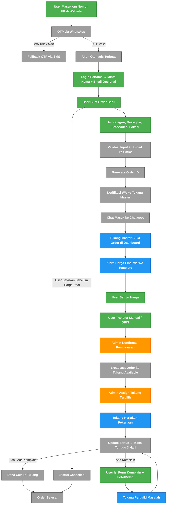

# Tukangin Requirements (Web App + WhatsApp Integration)

## Functional Requirements

### **Consumer Side (Web App)**

1. **User Registration & Login**
    - **OAuth Login, full user management kita yang atur.**
        - Karena goals di awal adalah **ingin meminimalisir friction, data yang harus user isi jangan kebanyakan.**
    - **Auto-create account** saat login pertama kali via OAuth.
    - Flow permintaan data customer:
        - Register cukup pake **nomor handphone → verifikasi via OTP WA/SMS → Akun berhasil dibuat.**
            - Harus disimpan dalam format **E.164 agar kompatibel dengan API WA/SMS.**
        - Setelah login pertama → **minta nama lengkap + email (optional).**
        - Saat mau order pertama → minta **alamat**
    - Fitur *remember me* untuk login cepat.
2. **Service Request Form**
    - UI intuitif mirip ride-hailing (dropdown/ikon kategori).
    - Pilih jenis layanan perbaikan (kategori: listrik, AC, plumbing, dll).
        - **HARUS DISESUAIKAN DAN NGOBROL SAMA COO.**
    - Input deskripsi masalah.
        - Minimal 20 karakter.
    - Upload foto/video kerusakan (harus ada auto kompresi untuk foto dan video (max 30MB total), max 5 foto dan 1 video, format JPG/PNG/MP4).
    - Input lokasi (Google Maps autocomplete).
    - Tombol “Buat Order” yang memicu:
        1. Order ID unik dibuat.
        2. Order tersimpan di database + S3/R2 (media).
        3. Notifikasi dikirim ke Tukang Master via WA.
            1. Notifikasi bahwa ada orderan masuk dan akan ada customer chat ke dia.
3. **Order Management**
    - Melihat status order real-time (status: Pending Harga, Menunggu Pembayaran, Pembayaran Selesai, Dikerjakan, Masa Tunggu, Selesai).
    - Riwayat order (filter: bulan, kategori, status).
    - Fitur Re-order → membuat order baru dari riwayat dengan data yang sama.
    - Notifikasi via email/WA saat status berubah.

### **Admin Side (Web Dashboard)**

1. **Order Monitoring**
    - List semua order dengan filter (status, tukang, tanggal, kategori).
    - Detail order (info user, deskripsi, foto/video, lokasi, harga).
    - Tracking timeline order (history status).
    - Notifikasi WA saat order baru masuk.
2. **Harga & Pembayaran**
    - Tukang Master menginput harga final di dashboard.
    - Sistem kirim harga ke pelanggan via WA, **lengkap berdasarkan tata cara dll**.
        - Pembayaran bisa TF atau QRIS.
    - Update status otomatis ke “Menunggu Pembayaran”.
    - Konfirmasi manual menjadi Pembayaran Selesai setelah pembayaran via transfer masuk.
3. **Broadcast & Assign Tukang**
    - Setelah pembayaran dikonfirmasi → sistem broadcast order ke semua tukang yang tersedia.
    - Admin akan meng-assign tukang yang available/paling cocok.
        - Setelah di-assign status berubah menjadi Dikerjakan.
    - Setelah tukang selesai mengerjakannya, status berubah menjadi Masa Tunggu.
        - Jika tidak ada masalah, dana cair ke Tukang dan status berubah menjadi Selesai.
        - Jika ada masalah, status kembali berubah menjadi Dikerjakan.
    - *Sementara belum ada algoritma matching dulu.*
4. **User Management**
    - List semua pengguna.
    - Fitur blokir/suspend akun.
    - Riwayat order & pembayaran user.
5. **Tukang Management & Performance**
    - List tukang.
    - Data pendapatan tukang (periode harian/mingguan/bulanan).
    - Feedback pelanggan untuk tukang.
    - Riwayat pekerjaan tukang.
6. **Report & Analytics**
    - Jumlah order per kategori.
    - Performa tukang (jumlah pekerjaan selesai, rating rata-rata).
    - Persentase komplain garansi.

### **WhatsApp Side (via Evolution API + Chatwoot)**

1. **WA Message Handling**
    - Semua chat masuk pelanggan ditangani via Chatwoot.
    - Setup auto assign ketika ada chat masuk.
    - Setup grouping per role: Admin, Tukang, Tukang Master.
    - Auto-reply:
        - Diluar jam operasional: kirim jam kerja.
        - Keyword tertentu: misalnya “status” → kirim status order.
    - Order baru → sistem kirim:
        - Order ID.
        - Link dashboard internal untuk Tukang Master.
2. **Harga & Konfirmasi**
    - Tukang Master mengirimkan harga ke pelanggan via WA template message.
    - Jika pelanggan setuju → diarahkan ke transfer manual.
    - Konfirmasi pembayaran dilakukan di dashboard.
3. **Broadcast & Assign**
    - Setelah pembayaran terkonfirmasi, WA broadcast otomatis ke semua tukang yang aktif.
    - Tukang yang available akan di assign oleh Tukang Master.
4. **Garansi & Komplain**
    - Saat pekerjaan selesai → status “Garansi 3 Hari”.
    - Jika pelanggan chat “komplain” → WA mengirim link form komplain (upload foto/video masalah).
        - Tapi akan ada di web juga.
    - Tukang assigned diberi notifikasi untuk perbaikan.

## **System Status Flow (Developer Mapping)**

1. **Pending Harga** → order baru, belum ada harga.
2. **Menunggu Pembayaran** → harga sudah dikirim, menunggu transfer.
3. Pembayaran Selesai → pembayaran sudah diterima, order di-assign ke tukang yang ada.
4. **Dikerjakan** → tukang menerima order, pekerjaan berjalan.
5. Masa Tunggu → tukang selesai mengerjakan, otomatis masuk masa tunggu 3 hari dihitung dari tanggal ketika status Dikerjakan diubah menjadi Masa Tunggu.
6. **Selesai** → garansi aman, dana masuk ke tukang, dan order ditutup.
7. Batal → order dibatalkan user atau force majeure.

## **Tech Stack & Implementation Notes**

- **Frontend**: Next.js + TailwindCSS
    - Integrasi Google Maps API untuk lokasi.
    - State management: Zustand/Redux.
    - Realtime update status via WebSocket.
- **Backend**: Node.js + Express
    - API REST + WebSocket untuk status order.
    - Middleware autentikasi JWT (OAuth callback → JWT).
    - Validasi file upload & integrasi AWS S3 atau Cloudflare R2.
- **Database**: PostgreSQL
    - Tabel: users, orders, order_status, tukang, payments, feedback.
    - Index di kolom status & created_at untuk query cepat.
- **WhatsApp Integration**: Evolution API + Chatwoot
    - Endpoint untuk kirim & terima pesan.
    - Template WA untuk harga, konfirmasi, status.
    - Webhook Chatwoot → trigger update status di backend.
- **File Storage**: AWS S3 atau Cloudflare R2
    - Folder structure: `/orders/{order_id}/{filename}`.
    - Presigned URL untuk upload langsung dari frontend.

